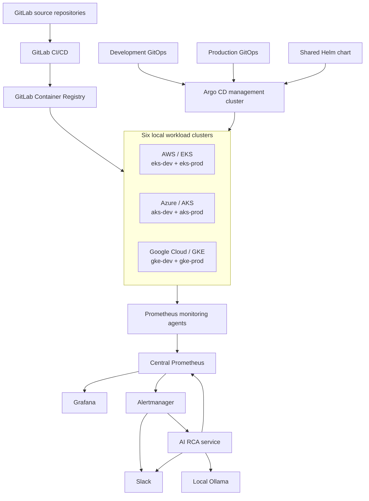
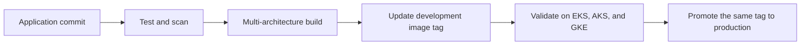

# Enterprise Multi-Cloud GitOps Lab

Local AWS, Azure, and Google Cloud Kubernetes environments managed through one
GitOps control plane, with centralized monitoring, Slack alerting, and an
experimental local-AI root-cause analysis workflow.

> **Important:** This project is a development, testing, CI, and learning lab.
> Floci emulates cloud APIs and cloud-shaped services locally; it is not a
> replacement for production AWS, Azure, Google Cloud, or a production-grade
> on-premises Kubernetes platform.

## Overview

This project demonstrates a complete multi-cloud platform workflow on a local
machine:

- Two AWS EKS-shaped clusters: development and production
- Two Azure AKS-shaped clusters: development and production
- Two Google GKE-shaped clusters: development and production
- One dedicated Kind management cluster
- One Argo CD instance controlling all six workload clusters
- Separate development and production GitOps repositories
- One reusable Helm chart across every cloud and environment
- GitLab CI/CD producing multi-architecture container images
- Central Prometheus, Grafana, and Alertmanager
- Monitoring agents forwarding metrics from all six clusters
- Production-style Slack notifications
- Experimental AI-assisted RCA using a local Ollama model
- A GitHub monorepo used as the consolidated portfolio mirror

The application, chart, GitOps configuration, platform bootstrap, observability,
and AI RCA source are all maintained as code.

## Architecture



## Platform Inventory

| Layer | Component | Purpose |
|---|---|---|
| Cloud emulation | Floci AWS, Floci Azure, Floci GCP | Local cloud API and service emulation |
| Workload clusters | Six single-node k3s clusters | Local EKS-, AKS-, and GKE-shaped targets |
| Management cluster | Kind `platform-mgmt` | Hosts Argo CD and the central monitoring stack |
| GitOps controller | Argo CD | Reconciles applications across all clusters |
| Application packaging | Helm | Reusable deployment configuration |
| CI/CD | GitLab CI/CD | Tests code and builds container images |
| Container registry | GitLab Container Registry | Stores multi-architecture application and RCA images |
| Metrics | Prometheus | Central metric storage, rules, and queries |
| Dashboards | Grafana | Multi-cloud dashboards and visualization |
| Alerting | Alertmanager | Routing, grouping, firing, and resolved notifications |
| Notification channel | Slack `#skm_alerts` | Operational alert delivery |
| Local AI | Ollama with `llama3.2:3b` | Evidence-bounded RCA hypothesis generation |
| Portfolio mirror | GitHub monorepo | Consolidated public-facing project source |

## Cluster Inventory

| Provider | Environment | Context | Local API endpoint | Application namespace |
|---|---|---|---|---|
| AWS / EKS | Development | `eks-dev` | `https://localhost:6500` | `dev-demo-app` |
| AWS / EKS | Production | `eks-prod` | `https://localhost:6501` | `prod-demo-app` |
| Azure / AKS | Development | `aks-dev` | `https://localhost:6600` | `dev-demo-app` |
| Azure / AKS | Production | `aks-prod` | `https://localhost:6601` | `prod-demo-app` |
| Google Cloud / GKE | Development | `gke-dev` | `https://localhost:6700` | `dev-demo-app` |
| Google Cloud / GKE | Production | `gke-prod` | `https://localhost:6701` | `prod-demo-app` |

The workload clusters use k3s inside Docker containers. They represent cloud
provider control-plane workflows for local testing; they do not provide the
managed infrastructure, SLA, IAM, networking, storage, or availability-zone
behavior of real EKS, AKS, or GKE.

## Repository Layout

This GitHub repository combines the histories of five GitLab repositories using
Git subtrees.

| Directory | Responsibility |
|---|---|
| `multicloud-demo-app/` | Go demo service, tests, Dockerfile, and GitLab pipeline |
| `multicloud-helm-charts/` | Shared Helm chart for every cloud and environment |
| `multicloud-gitops-dev/` | Development image tag and cloud-specific values |
| `multicloud-gitops-prod/` | Production image tag and cloud-specific values |
| `multicloud-platform-bootstrap/` | Argo CD, ApplicationSets, monitoring, alerting, UI customization, and AI RCA |

### Important platform paths

| Path | Content |
|---|---|
| `multicloud-platform-bootstrap/argocd/projects/` | Argo CD AppProjects |
| `multicloud-platform-bootstrap/argocd/applications/` | Central platform applications |
| `multicloud-platform-bootstrap/argocd/applicationsets/` | Multi-cluster application generation |
| `multicloud-platform-bootstrap/argocd/ui/` | Cloud badges and Argo CD UI extension |
| `multicloud-platform-bootstrap/observability/central/` | Central Prometheus, Grafana, Alertmanager, dashboards, and rules |
| `multicloud-platform-bootstrap/services/ai-rca/` | Go-based AI RCA webhook service |

## Local Workspace Layout

The lab was developed with the following adjacent local directories:

| Local directory | Purpose |
|---|---|
| `enterprise-multicloud-floci/` | Floci emulator lifecycle, cluster creation, kubeconfigs, and verification |
| `multicloud-demo-app/` | GitLab application source repository |
| `multicloud-helm-charts/` | GitLab Helm repository |
| `multicloud-gitops-dev/` | GitLab development GitOps repository |
| `multicloud-gitops-prod/` | GitLab production GitOps repository |
| `multicloud-platform-bootstrap/` | GitLab platform repository |
| `enterprise-multicloud-gitops/` | Consolidated GitHub monorepo |

## Tested Environment

| Tool or resource | Tested value |
|---|---|
| Host | Apple Silicon macOS |
| Host CPU | 15 cores |
| Host memory | 24 GB |
| Docker memory | Approximately 15.8 GiB |
| Docker | 29.x |
| Kind | 0.31.0 |
| kubectl | 1.36.1 |
| Helm | 4.2.0 |
| Argo CD | 3.4.x |
| k3s workload clusters | 1.34.1+k3s1 |
| Ollama | 0.30.8 |
| Ollama model | `llama3.2:3b` |

For all six workload clusters plus the management and monitoring stack, allocate
approximately:

- 12 or more CPU cores
- 14–16 GiB of Docker memory
- 24 GB host memory recommended
- At least 40 GB of free disk for images, volumes, and build caches

## Prerequisites

Install the required tools:

```bash
brew install \
  awscli \
  argocd \
  docker \
  git \
  glab \
  helm \
  kind \
  kubectl \
  ollama \
  python
```

Docker Desktop must be running before starting the lab.

Verify the main tools:

```bash
docker version
kind version
kubectl version --client
helm version
argocd version --client
glab version
ollama --version
```

## Start the Floci Lab

Run these commands from the companion Floci lifecycle directory:

```bash
cd /Users/skm/MULI_CLOUD_FLOCI/enterprise-multicloud-floci

make preflight
make start
make create
```

Expected result:

```text
Verification complete: 6/6 clusters reachable
```

The merged workload kubeconfig is:

```text
.kubeconfigs/all.yaml
```

The management-cluster kubeconfig is:

```text
.kubeconfigs/platform-mgmt.yaml
```

## Verify All Six Clusters

List the six contexts:

```bash
kubectl \
  --kubeconfig .kubeconfigs/all.yaml \
  config get-contexts
```

Display a compact cluster table:

```bash
printf '%-10s %-14s %-8s %-18s\n' \
  "CLUSTER" "NODE" "STATUS" "VERSION"

for cluster in \
  eks-dev eks-prod \
  aks-dev aks-prod \
  gke-dev gke-prod
do
  kubectl \
    --kubeconfig .kubeconfigs/all.yaml \
    --context "$cluster" \
    get nodes \
    --no-headers |
  awk -v cluster="$cluster" \
    '{printf "%-10s %-14s %-8s %-18s\n", cluster, $1, $2, $5}'
done
```

## Management Cluster and Argo CD

Verify the management node:

```bash
kubectl \
  --kubeconfig .kubeconfigs/platform-mgmt.yaml \
  get nodes -o wide
```

Verify Argo CD:

```bash
kubectl \
  --kubeconfig .kubeconfigs/platform-mgmt.yaml \
  --namespace argocd \
  get pods
```

Open the Argo CD UI:

```bash
kubectl \
  --kubeconfig .kubeconfigs/platform-mgmt.yaml \
  --namespace argocd \
  port-forward service/argocd-server 8080:443
```

Open:

```text
https://localhost:8080
```

Argo CD login sessions expire. Log in again when required:

```bash
argocd login localhost:8080 \
  --username admin \
  --grpc-web
```

## Argo CD Application Model

The platform uses separate Argo CD projects:

- `multicloud-dev`
- `multicloud-prod`
- `multicloud-platform`

ApplicationSets generate one application for each target cluster.

### Workload applications

| Environment | Generated applications |
|---|---|
| Development | `eks-dev-demo-app`, `aks-dev-demo-app`, `gke-dev-demo-app` |
| Production | `eks-prod-demo-app`, `aks-prod-demo-app`, `gke-prod-demo-app` |

### Platform applications

- `central-monitoring`
- Monitoring-agent applications for all workload clusters

Display the Argo CD application status without depending on an Argo CD CLI
session:

```bash
kubectl \
  --kubeconfig .kubeconfigs/platform-mgmt.yaml \
  --namespace argocd \
  get applications \
  --output \
'custom-columns=APPLICATION:.metadata.name,CLUSTER:.spec.destination.name,SYNC:.status.sync.status,HEALTH:.status.health.status'
```

## Argo CD Cloud Identity

The Argo CD Application tiles are customized to make cloud identity visible:

- `AWS` badge for EKS applications
- `AZURE` badge for AKS applications
- `GCP` badge for GKE applications

The customization is maintained through:

```text
multicloud-platform-bootstrap/argocd/ui/
```

It uses:

- A chart-managed custom stylesheet
- An Argo CD extension
- Application labels and metadata generated by ApplicationSets

## Demo Application

The demo application is a small Go HTTP service that exposes:

- `/` — cloud- and environment-specific application response
- `/health` — health endpoint
- `/metrics` — Prometheus metrics

Example AWS development response:

```json
{
  "cloud": "aws",
  "environment": "dev",
  "message": "Hello from the AWS development environment",
  "service": "multicloud-demo-app",
  "version": "d13d5e27"
}
```

The Azure and GCP deployments use the same container image and Helm chart, while
their values provide cloud-specific messages and metadata.

## Application Testing

Run the Go tests without installing Go locally:

```bash
cd multicloud-demo-app

docker run --rm \
  --volume "$PWD:/src" \
  --workdir /src \
  golang:1.26-alpine \
  go test -cover ./...
```

Build a local ARM64 image:

```bash
docker build \
  --tag multicloud-demo-app:local \
  multicloud-demo-app
```

## GitLab CI/CD

The application and AI RCA pipelines perform:

1. Go formatting validation
2. `go vet`
3. Unit testing and coverage
4. Multi-stage container builds
5. Multi-architecture image publication
6. Registry publication using commit-specific tags

Published platforms:

```text
linux/amd64
linux/arm64
```

Application image:

```text
registry.gitlab.com/skcloud2007/multicloud-demo-app:<commit-sha>
```

AI RCA image:

```text
registry.gitlab.com/skcloud2007/multicloud-platform-bootstrap/ai-rca:<commit-sha>
```

Commit-specific immutable tags are used by GitOps instead of relying only on
`latest`.

## GitOps Deployment and Promotion Flow



### Development values

```text
multicloud-gitops-dev/apps/multicloud-demo-app/values/
```

Files:

- `common.yaml`
- `aws.yaml`
- `azure.yaml`
- `gcp.yaml`

### Production values

```text
multicloud-gitops-prod/apps/multicloud-demo-app/values/
```

Production uses:

- A separately controlled GitOps repository
- Two replicas
- A PodDisruptionBudget
- The same tested image digest or immutable tag promoted from development

### Promotion principle

Build once and promote the same image:

```text
Application commit
      ↓
Immutable registry tag
      ↓
Development validation
      ↓
Production GitOps update
```

No CI job directly modifies a Kubernetes cluster. Argo CD pulls the declared
state from Git and performs reconciliation.

## Central Monitoring

The central monitoring stack runs in the `monitoring` namespace of the
management cluster.

It includes:

- Prometheus Operator
- Prometheus
- Grafana
- Alertmanager
- kube-state-metrics
- Node Exporter
- Multi-cloud alert rules
- A central multi-cloud dashboard

Verify the monitoring components:

```bash
kubectl \
  --kubeconfig .kubeconfigs/platform-mgmt.yaml \
  --namespace monitoring \
  get pods
```

### Monitoring agents

Each workload cluster runs a lightweight monitoring agent containing:

- Prometheus Agent
- kube-state-metrics
- Node Exporter

Metrics are forwarded to the central Prometheus remote-write receiver.

Verify all agents:

```bash
for cluster in \
  eks-dev eks-prod \
  aks-dev aks-prod \
  gke-dev gke-prod
do
  echo "===== $cluster ====="

  kubectl \
    --kubeconfig .kubeconfigs/all.yaml \
    --context "$cluster" \
    --namespace monitoring-agent \
    get pods
done
```

### Open Grafana

```bash
kubectl \
  --kubeconfig .kubeconfigs/platform-mgmt.yaml \
  --namespace monitoring \
  port-forward service/central-monitoring-grafana 3000:80
```

Open:

```text
http://localhost:3000
```

### Open Prometheus

```bash
kubectl \
  --kubeconfig .kubeconfigs/platform-mgmt.yaml \
  --namespace monitoring \
  port-forward service/central-monitoring-prometheus 9090:9090
```

Open:

```text
http://localhost:9090
```

### Open Alertmanager

```bash
kubectl \
  --kubeconfig .kubeconfigs/platform-mgmt.yaml \
  --namespace monitoring \
  port-forward service/central-monitoring-alertmanager 9093:9093
```

Open:

```text
http://localhost:9093
```

## Multi-Cloud Alert Rules

The platform includes centralized rules for:

- Missing clusters
- Failed scrape targets
- Kubernetes nodes not ready
- High node CPU usage
- High node memory usage
- Repeated container restarts
- Production workloads without available replicas

Alert labels include:

- `cloud`
- `cluster`
- `environment`
- `severity`
- `team`

These labels allow one Alertmanager instance to route alerts consistently across
AWS, Azure, and GCP environments.

## Slack Notifications

Alertmanager sends structured firing and resolved messages to:

```text
#skm_alerts
```

The message includes:

- Firing or resolved status
- Alert name and summary
- Cloud provider
- Cluster
- Environment
- Severity
- Owning team
- Grafana link
- Prometheus link
- Alertmanager link
- Argo CD link

The Slack webhook is not committed to Git. It is stored as:

```text
Secret: central-monitoring-slack-webhook
Namespace: monitoring
Key: api-url
```

Example secure creation:

```bash
read -rsp "Slack webhook URL: " slack_webhook
echo

kubectl \
  --kubeconfig .kubeconfigs/platform-mgmt.yaml \
  --namespace monitoring \
  create secret generic central-monitoring-slack-webhook \
  --from-literal=api-url="$slack_webhook" \
  --dry-run=client \
  --output yaml |
kubectl \
  --kubeconfig .kubeconfigs/platform-mgmt.yaml \
  apply -f -

unset slack_webhook
```

## AI-Assisted RCA

The experimental RCA service receives authenticated firing-alert webhooks from
Alertmanager and performs the following workflow:

1. Accept the Alertmanager payload
2. Validate a bearer token
3. Reject resolved or duplicate alerts
4. Query central Prometheus for bounded evidence
5. Send only the alert context and observed evidence to local Ollama
6. Request a structured RCA hypothesis
7. Send a separate AI-assisted RCA card to Slack

The service never performs automatic remediation.

### Safety boundaries

- No Kubernetes credentials are mounted into the RCA pod
- `automountServiceAccountToken` is disabled
- The container runs as a non-root user
- The root filesystem is read-only
- Linux capabilities are dropped
- The service can query evidence but cannot change workloads
- Model output is treated as a hypothesis
- Human validation is always required

### RCA output structure

The local model is asked to return:

- Incident summary
- Probable cause
- Confidence
- Supporting evidence
- Expected impact
- Recommended checks
- Limitations
- Human-validation requirement

### Local Ollama

Start Ollama:

```bash
ollama serve
```

Pull or verify the model:

```bash
ollama pull llama3.2:3b
ollama list
```

The management cluster reaches the host Ollama API through:

```text
http://host.docker.internal:11434
```

Test connectivity:

```bash
kubectl \
  --kubeconfig .kubeconfigs/platform-mgmt.yaml \
  --namespace monitoring \
  run ollama-connectivity-check \
  --image=curlimages/curl \
  --restart=Never \
  --rm \
  --attach \
  --command -- \
  curl --fail --silent \
  http://host.docker.internal:11434/api/version
```

### AI RCA status

Current status:

- RCA service source, tests, container image, and Kubernetes deployment are available
- Local Ollama and central Prometheus dependency checks are healthy
- Alertmanager authentication is configured
- Standard Slack firing and resolved alerts are operational
- Final end-to-end AI-generated Slack RCA delivery remains under validation

The AI integration should therefore be treated as experimental.

## Kubernetes Secrets

The following runtime Secrets are intentionally excluded from Git:

| Secret | Purpose |
|---|---|
| `central-monitoring-slack-webhook` | Slack incoming webhook |
| `gitlab-platform-registry` | Read-only pull access for the private GitLab registry |
| `ai-rca-webhook-auth` | Alertmanager-to-RCA bearer authentication |
| `central-monitoring-grafana-admin` | Grafana administrator credentials |

Never commit:

- Kubeconfig files
- Slack webhooks
- GitLab deploy tokens
- Registry credentials
- Argo CD passwords or tokens
- Grafana passwords
- Private keys

## Secret Scanning

Scan the complete Git history before publishing:

```bash
gitleaks git . \
  --redact \
  --verbose
```

The platform-bootstrap repository was scanned across all commits before the
public-mirror workflow, with no leaks detected.

Run the scan again against this complete monorepo before changing its visibility.

## Resume After a Laptop Restart

Docker containers normally stop when the laptop is shut down.

### 1. Start Docker Desktop

```bash
open -a Docker

until docker info >/dev/null 2>&1; do
  echo "Waiting for Docker Desktop..."
  sleep 5
done
```

### 2. Start Floci emulators

```bash
cd /Users/skm/MULI_CLOUD_FLOCI/enterprise-multicloud-floci
make start
```

### 3. Start existing workload containers

```bash
docker ps -a \
  --format '{{.Names}}' |
grep -E '^floci-(eks|az-aks|gke|ecr)' |
while read -r container; do
  docker start "$container" >/dev/null
  echo "Started $container"
done
```

### 4. Start the management cluster

```bash
docker start platform-mgmt-control-plane \
  >/dev/null 2>&1 || true
```

### 5. Refresh kubeconfigs

```bash
cd /Users/skm/MULI_CLOUD_FLOCI/enterprise-multicloud-floci
make create
```

This refresh step is important because locally generated k3s credentials can
change after container restarts.

### 6. Reopen UI connections

Port-forward processes do not survive a shutdown. Start the Argo CD, Grafana,
Prometheus, and Alertmanager port-forwards again when required.

## Compact Operational Checks

### Docker status

```bash
docker ps \
  --format 'table {{.Names}}\t{{.Status}}\t{{.Ports}}' |
grep -E 'NAMES|enterprise-floci|floci-|platform-mgmt'
```

### Docker resource usage

```bash
docker stats --no-stream \
  --format 'table {{.Name}}\t{{.CPUPerc}}\t{{.MemUsage}}\t{{.PIDs}}'
```

### Six-cluster readiness

```bash
for cluster in \
  eks-dev eks-prod \
  aks-dev aks-prod \
  gke-dev gke-prod
do
  printf '%-10s ' "$cluster"

  kubectl \
    --kubeconfig .kubeconfigs/all.yaml \
    --context "$cluster" \
    get nodes \
    --no-headers
done
```

### Application status

```bash
kubectl \
  --kubeconfig .kubeconfigs/platform-mgmt.yaml \
  --namespace argocd \
  get applications \
  --output \
'custom-columns=APPLICATION:.metadata.name,CLUSTER:.spec.destination.name,SYNC:.status.sync.status,HEALTH:.status.health.status'
```

### Central monitoring

```bash
kubectl \
  --kubeconfig .kubeconfigs/platform-mgmt.yaml \
  --namespace monitoring \
  get pods
```

## Lab-Specific Compatibility Fixes

This local Docker-based environment required several compatibility adjustments:

### Live kubeconfig refresh

EKS- and GKE-shaped cluster kubeconfigs are refreshed from the live k3s
containers. This prevents stale credentials after Docker or laptop restarts.

### AKS provisioning-state workaround

Floci Azure can continue reporting `Creating` even after the Kubernetes API is
healthy. The lifecycle script verifies the API endpoint and continues when it
receives the expected unauthenticated HTTP response from a healthy Kubernetes
API.

### AKS certificate refresh

The AKS kubeconfig is extracted from the live k3s container so that the current
certificate authority is used.

### Local Argo CD cluster endpoints

Argo CD reaches workload APIs through `host.docker.internal`. Local certificates
use insecure TLS verification in this lab only.

### Node Exporter mount propagation

The Floci k3s nodes run inside Docker containers. Node Exporter's usual
`HostToContainer` root-mount propagation is disabled because the nested root
mount is not configured as shared or slave.

These workarounds are specific to the local nested-container lab and should not
be copied into production without understanding the underlying security and
runtime implications.

## Troubleshooting

### Cluster requests ask for credentials after restart

Refresh all kubeconfigs:

```bash
cd /Users/skm/MULI_CLOUD_FLOCI/enterprise-multicloud-floci
make create
```

### TLS certificate signed by unknown authority

Regenerate the kubeconfig from the live k3s container. Avoid permanently
disabling TLS verification for production clusters.

### Argo CD CLI token expired

```bash
argocd login localhost:8080 \
  --username admin \
  --grpc-web
```

### Argo CD cannot reach a cluster

Check:

```bash
argocd cluster list
```

Then validate the API endpoint from the management cluster:

```bash
kubectl \
  --kubeconfig .kubeconfigs/platform-mgmt.yaml \
  --namespace argocd \
  run cluster-connectivity-check \
  --image=curlimages/curl \
  --restart=Never \
  --rm \
  --attach \
  --command -- \
  curl --insecure \
  https://host.docker.internal:6500/livez
```

An HTTP `401 Unauthorized` response proves that the Kubernetes API is reachable
and healthy but requires authentication.

### PrometheusRule is not loaded

Confirm that its labels match the Prometheus selector:

```bash
kubectl \
  --kubeconfig .kubeconfigs/platform-mgmt.yaml \
  --namespace monitoring \
  get prometheus \
  --output \
'jsonpath={range .items[*]}{.metadata.name}{" selector="}{.spec.ruleSelector}{"\n"}{end}'
```

The current selector requires:

```yaml
metadata:
  labels:
    release: central-monitoring
```

### AI RCA receives no alert

Check each stage separately:

1. Prometheus rule state
2. Alertmanager active alerts
3. AlertmanagerConfig webhook URL
4. RCA Deployment readiness
5. RCA service logs
6. Ollama connectivity
7. Prometheus connectivity
8. Slack webhook delivery

RCA logs:

```bash
kubectl \
  --kubeconfig .kubeconfigs/platform-mgmt.yaml \
  --namespace monitoring \
  logs deployment/ai-rca \
  --since=15m
```

## Security Model

This lab applies several production-oriented practices:

- Immutable image tags
- Separate development and production GitOps repositories
- Argo CD AppProject boundaries
- Automated reconciliation and pruning
- Non-root containers
- Read-only root filesystems
- Resource requests and limits
- PodDisruptionBudget for production
- NetworkPolicy in the application chart
- Read-only registry deploy token
- Runtime Secrets excluded from Git
- Gitleaks history scanning
- Human approval boundary for AI analysis

Local-lab exceptions:

- Self-signed certificates
- Insecure TLS for local Argo CD cluster registration
- Single-node clusters
- Host networking through Docker Desktop
- Locally stored kubeconfigs
- NodePort-based cross-cluster monitoring transport

These exceptions are not recommended for production.

## Production Migration

The GitOps operating model can be migrated to:

- Real AWS EKS
- Real Azure AKS
- Real Google GKE
- Production-grade Kubernetes on owned servers
- RKE2, OpenShift, or another supported on-premises distribution

Reusable components:

- Application container
- Helm chart
- GitOps repository structure
- Argo CD projects and ApplicationSets
- Prometheus rules
- Grafana dashboards
- Alertmanager routing
- Slack notification format
- AI RCA service with appropriate security controls

Components that must be redesigned or validated:

- Cloud IAM and workload identity
- VPC, VNet, and GCP networking
- Ingress, DNS, and load balancers
- Storage classes and backup strategy
- Private connectivity between clusters
- TLS and certificate management
- Registry authentication
- Secrets management
- Multi-zone availability
- Autoscaling
- Disaster recovery
- SLOs and error budgets
- Audit, compliance, and retention requirements
- Production AI governance and data controls

## Known Limitations

- The workload clusters are single-node k3s containers
- Cloud behavior is emulated
- Provider SLAs are not represented
- Local resource contention can affect measurements
- Docker Desktop networking differs from production networking
- Local endpoints depend on the host and Docker network
- Port-forwards must be restarted after shutdown
- The AI RCA integration remains experimental
- AI output can be incomplete or incorrect and requires validation

## Roadmap

- Complete AI RCA-to-Slack validation
- Add structured AI RCA testing and failure metrics
- Add SLO and error-budget dashboards
- Add centralized log and trace collection
- Add policy-as-code enforcement
- Add secret encryption with SOPS or External Secrets
- Add signed images and admission verification
- Add NetworkPolicy enforcement to the management cluster
- Add backup and restore exercises
- Add controlled failure and recovery scenarios
- Validate the GitOps model against real or on-premises production-grade clusters

## Project Status

| Capability | Status |
|---|---|
| Six local Floci Kubernetes clusters | Working |
| Separate development and production environments | Working |
| Central Argo CD management | Working |
| Development deployments across three clouds | Working |
| Production deployments across three clouds | Working |
| Multi-architecture GitLab image pipeline | Working |
| Central Prometheus and Grafana | Working |
| Monitoring agents on all six clusters | Working |
| Professional Slack firing/resolved alerts | Working |
| Cloud badges in Argo CD | Working |
| Local Ollama structured RCA generation | Working in isolated tests |
| End-to-end AI RCA Slack delivery | Experimental / validation in progress |

## References

- [Floci — Any cloud. Locally.](https://floci.io/)
- [Argo CD](https://argo-cd.readthedocs.io/)
- [Kubernetes](https://kubernetes.io/)
- [Helm](https://helm.sh/)
- [Prometheus](https://prometheus.io/)
- [Grafana](https://grafana.com/)
- [Alertmanager](https://prometheus.io/docs/alerting/latest/alertmanager/)
- [Ollama](https://ollama.com/)

## Disclaimer

This repository is a personal engineering and learning project. Cloud provider
names and managed Kubernetes product names are used to describe the APIs and
operational patterns being emulated. The project is not affiliated with or
endorsed by AWS, Microsoft Azure, Google Cloud, Floci, or the other referenced
open-source projects.
